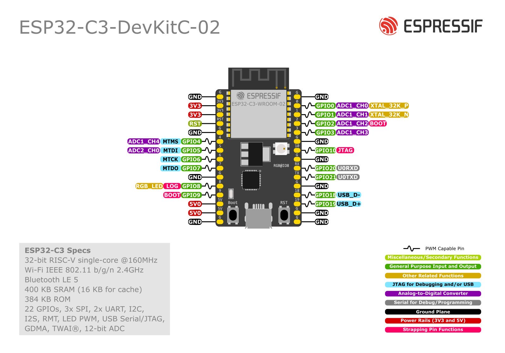

# Speed camera alerter

A bare-metal Rust firmware for the ESP32-C3 that watches your GPS position and
warns you — red LED and two short beeps — when you are **driving toward** a speed
or red-light camera.

The "driving toward" part is the whole point. A device that beeps every time a
camera is within a few hundred metres is noise; this one stays quiet unless three
things are true at once:

- the camera is within **800 ft** (0.244 km, great-circle),
- your heading is within **25°** of the bearing to it, and
- you are moving faster than **~12 mph**, so it is silent when you are parked.

<p align="center">
  
</p>

No allocator-heavy runtime, no cloud service, no phone. The camera database is
compiled into the binary as a perfect hash map, so a lookup is a hash and a
compare, and the device works with no network connection at all.

## How it works

```
  GPS module ──NMEA @9600──> gps_task ─────┐
                              parses           │
                         $GPRMC / $GPGGA       │  lat, lon, speed,
                                               │  heading, fix, time
                                               v
                                        ┌─────────────┐
                                        │  GPS_DATA   │  one async mutex
                                        └─────────────┘
                                          │     │     │
                 every 3 s ───────────────┘     │     └────────────┐
                        v                       v                  v
              proximity_check_task      led_control_task   buzzer_control_task
                        │                   red/green/          two 100 ms
       geohash(lat,lon) │ precision 7        yellow                beeps
       + its 8 neighbours                                    once per alert
                        v
              ┌───────────────────┐
              │ GEO_MAP (phf)     │  built at compile time by build.rs
              │ 183 camera cells  │  from data/geodata.csv
              └───────────────────┘
                        │ candidate hit
                        v
          distance < 800 ft  AND  heading within 25°  AND  speed > 12 mph
                        │
                        v
                   notification
```

Position is encoded to a **precision-7 geohash** (roughly a 150 m cell). Rather
than scanning every camera on every tick, the firmware looks up that one cell plus
its eight neighbours — nine constant-time probes into the perfect hash map — and
only then runs the haversine distance and bearing maths on whatever came back.
That is what keeps a 3-second check loop cheap enough to leave running
indefinitely on a microcontroller.

Everything runs as [Embassy](https://embassy.dev/) async tasks on a single
executor. There is no RTOS and no heap allocation on the GPS path.

### Two boot modes, one binary

A long press (2 s) on the mode button writes a magic value into the RTC `STORE0`
register and triggers a software reset. `STORE0` survives the reset, so the next
boot reads it and comes up in the other mode:

| Mode | What runs |
|---|---|
| **GPS** (default) | UART reader, proximity check, LED, buzzer |
| **WiFi/OTA** | SoftAP + [picoserve](https://crates.io/crates/picoserve) web server on `192.168.13.37`, with a drag-and-drop firmware upload page |

Another long press goes back. The radio is completely off in GPS mode, which is
where the device spends all of its time.

## Repository layout

| Path | What it is |
|---|---|
| [`firmware/`](firmware/) | The ESP32-C3 firmware. Its own Cargo project — `.cargo/config.toml` pins the RISC-V target. |
| [`geohash/`](geohash/) | `no_std` fork of [georust/geohash](https://github.com/georust/geohash) v0.13.1. See [NOTICE.md](geohash/NOTICE.md). |
| [`tools/geohash-prepper/`](tools/geohash-prepper/) | Host CLI that turns a CSV of coordinates into the table the firmware compiles in. |
| [`docs/`](docs/) | [Schematic](docs/SCHEMATIC.md), [wiring table](docs/WIRING_TABLE.md), [roadmap](docs/ROADMAP.md). |

These are three independent Cargo projects rather than one workspace, because the
firmware builds for `riscv32imc-unknown-none-elf` and the prepper is a host tool —
a single workspace would force one target on both.

## Hardware

ESP32-C3 Super Mini, a 9600-baud UART GPS module, three WS2812B LEDs, an active
buzzer and a momentary button. Full pinout and bring-up steps are in
[docs/WIRING_TABLE.md](docs/WIRING_TABLE.md).

## Build and flash

Needs a Rust nightly toolchain with the `rust-src` component and
[`espflash`](https://github.com/esp-rs/espflash). `rust-toolchain.toml` pins the
rest.

```bash
cargo install espflash

cd firmware
DEFMT_LOG=off cargo build --release     # production: logging compiled out
cargo run --release                     # flash over USB and open the monitor
```

For development, `DEFMT_LOG=debug cargo run` keeps the log output. Logging over
the USB serial link is not free — leave it off for anything you actually drive
around with.

To produce an image for the over-the-air updater instead:

```bash
espflash save-image --chip esp32c3 \
  ./target/riscv32imc-unknown-none-elf/release/gps \
  firmware.bin
```

Then long-press the button, join the `SpeedMe` access point, browse to
`http://192.168.13.37/` and upload that file.

### Changing the camera data

The shipped table covers **Chicago** (183 cells), from the city's open-data speed
camera list. To target somewhere else, find that city's open dataset and run it
through the prepper:

```bash
cd tools/geohash-prepper
cargo run -- path/to/your-cameras.csv ../../firmware/data/geodata.csv
cd ../../firmware && cargo build --release
```

`build.rs` picks up the new CSV and regenerates the perfect hash map.

### Access point credentials

The OTA access point defaults to SSID `SpeedMe`, password `speedme-ota`. It only
exists while the device is in OTA mode. Override at build time:

```bash
SPEEDME_AP_SSID=my-device SPEEDME_AP_PASSWORD=something-better cargo build --release
```

## Tests

```bash
cd geohash && cargo test          # 17 unit tests + doctests
```

The geohash encoder is the part worth testing in isolation: a wrong bit there
means silently missing a camera, with no symptom you would notice while driving.
The firmware itself is verified on hardware.

## Limitations

- **One region per binary.** The camera table is compiled in. Changing cities
  means rebuilding and reflashing.
- **No persistence.** Nothing is stored across reboots except the one-shot
  boot-mode flag in the RTC register.
- **Silent below ~12 mph**, by design — but that also means it will not warn you
  while crawling in traffic.
- **The data is as current as the CSV you built with.** Cities add and remove
  cameras; nothing here refreshes automatically.
- **Not a safety device.** It is a convenience alert built from public data, and
  it will miss cameras that are not in the dataset.

## License

Dual-licensed under [MIT](LICENSE-MIT) or [Apache-2.0](LICENSE-APACHE), at your
option.

`geohash/` is a fork of a third-party crate and carries its own upstream license
files and attribution — see [geohash/NOTICE.md](geohash/NOTICE.md).

Camera data in `tools/geohash-prepper/data/` is City of Chicago open data.
